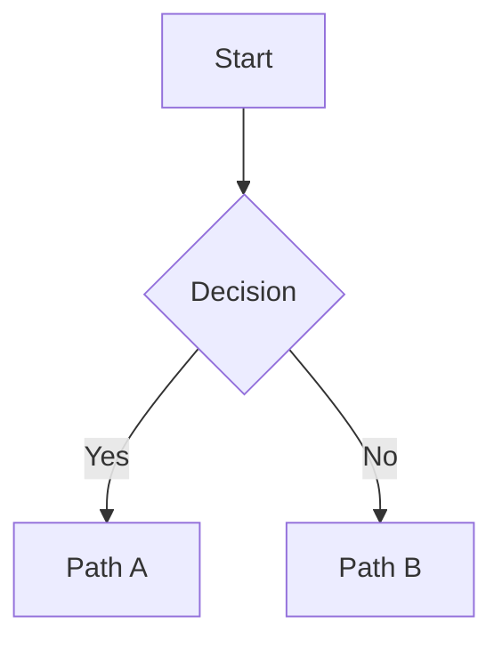

# Obsidian Flavored Markdown Skill

This skill enables agents to create and edit valid Obsidian Flavored Markdown, including all Obsidian-specific syntax extensions.

## Overview

Obsidian uses a combination of standard and extended Markdown flavors:

- [CommonMark](https://commonmark.org/) - Standard Markdown
- [GitHub Flavored Markdown](https://github.github.com/gfm/) - GFM extensions
- [LaTeX](https://www.latex-project.org/) - Math notation
- **Obsidian extensions** - Wikilinks, callouts, embeds, properties, and more

## Basic Formatting

### Text Styles

| Style         | Syntax                   | Example         |
| ------------- | ------------------------ | --------------- |
| Bold          | `**text**` or `__text__` | **Bold**        |
| Italic        | `*text*` or `_text_`     | _Italic_        |
| Bold + Italic | `***text***`             | **_Both_**      |
| Strikethrough | `~~text~~`               | ~~Striked~~     |
| Highlight     | `==text==`               | ==Highlighted== |
| Inline code   | `` `code` ``             | `code`          |

### Headings

```markdown
# Heading 1

## Heading 2

### Heading 3

#### Heading 4

##### Heading 5

###### Heading 6
```

### Escaping

Use backslash to escape special characters:

```markdown
\*This won't be italic\*
\#This won't be a heading
1\. This won't be a list item
```

## Wikilinks

Obsidian-specific links to other notes creating bidirectional relationships.

```markdown
[[Note Name]]
[[Note Name|Display Text]]
[[Note Name#Heading]]
[[Note Name#^block-id]]
[[#Heading in same note]]
```

Wikilinks automatically appear in backlinks and the Graph view.

See [Wikilinks](wikilinks.md) for complete documentation.

## Embeds

Include content from other files or external sources inline.

```markdown
![[Note Name]]
![[Note Name#Heading]]
![[image.png|300]]
![[audio.mp3]]
![[document.pdf#page=3]]
```

Embedded content updates automatically when the source changes.

See [Embeds](embeds.md) for all embed types and options.

## Callouts

Styled blocks that highlight important information.

```markdown
> [!note]
> This is a note.

> [!warning] Custom Title
> Important warning text.

> [!tip]+ Expanded by default
> Collapsible tip content.
```

Supported types: `note`, `abstract`, `info`, `todo`, `tip`, `success`, `question`, `warning`, `failure`, `danger`, `bug`, `example`, `quote`

See [Callouts](callouts.md) for all types and custom callouts.

## Properties (Frontmatter)

Add structured metadata at the start of a note:

```yaml
---
title: My Note
date: 2024-01-15
tags:
  - project
  - important
status: active
rating: 4.5
due: 2024-02-01T14:30:00
---
```

Properties enable querying in Bases and appear in the Properties panel.

## Tags

Categorize notes with inline tags:

```markdown
#project
#nested/tag
#tag-with-dashes
#tag_with_underscores
```

Tags can be:

- Inline in content
- Defined in frontmatter
- Organized hierarchically with forward slashes
- Viewed in tag pane and graph

See [Properties & Tags](properties-tags.md) for full reference.

## Markdown-Style Links

Standard Markdown links work alongside wikilinks:

```markdown
[Display Text](Note%20Name.md)
[Display Text](Note%20Name.md#Heading)
[Display Text](https://example.com)
[Note](obsidian://open?vault=VaultName&file=Note.md)
```

Note: Spaces must be URL-encoded as `%20`.

## Lists and Checkboxes

```markdown
- Unordered list
  - Nested item
    - Deeper nesting

1. Ordered list
2. Second item
   1. Nested ordered

- [ ] Unchecked task
- [x] Completed task
  - [x] Subtask done
  - [ ] Subtask pending
```

## Blockquotes

```markdown
> This is a blockquote
> spanning multiple lines
>
> With multiple paragraphs
```

## Advanced Features

### Math

Render LaTeX notation inline or in blocks:

```markdown
Inline: $E = mc^2$

Display:

$$
\frac{1}{2}mv^2 = E_k
$$
```

### Diagrams

Create diagrams with Mermaid syntax:

````markdown

````

### Footnotes

Add citations and references:

```markdown
This has a footnote[^1].

[^1]: The footnote content appears at the bottom.
```

### Comments

Hide content from reading view:

```markdown
This is visible %%but this is hidden%% text.

%%
Entire block comment
Not visible in reading view
%%
```

### Tables

```markdown
| Column 1 | Column 2 | Column 3 |
| :------- | :------: | -------: |
| Left     |  Center  |    Right |
```

## Reference Guides

- [Wikilinks](wikilinks.md) - Internal linking and relationships
- [Embeds](embeds.md) - Embedding notes, images, and media
- [Callouts](callouts.md) - Styled information blocks
- [Properties & Tags](properties-tags.md) - Metadata and categorization
- [Advanced Features](advanced.md) - Math, diagrams, footnotes, HTML
- [Examples](examples.md) - Complete example note

## External Resources

- [Basic formatting syntax](https://help.obsidian.md/syntax)
- [Advanced formatting syntax](https://help.obsidian.md/advanced-syntax)
- [Obsidian Flavored Markdown](https://help.obsidian.md/obsidian-flavored-markdown)
- [Internal links](https://help.obsidian.md/links)
- [Embed files](https://help.obsidian.md/embeds)
- [Callouts](https://help.obsidian.md/callouts)
- [Properties](https://help.obsidian.md/properties)
