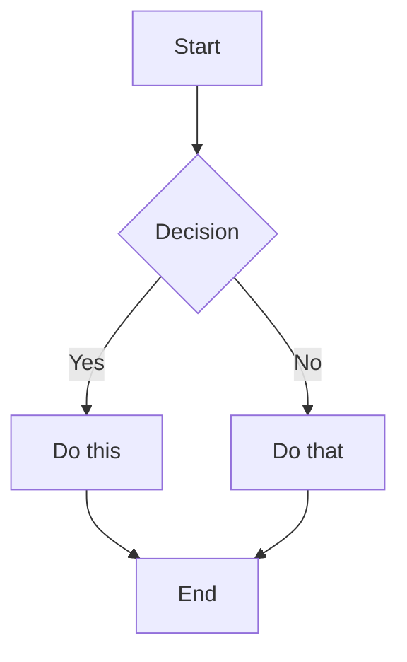
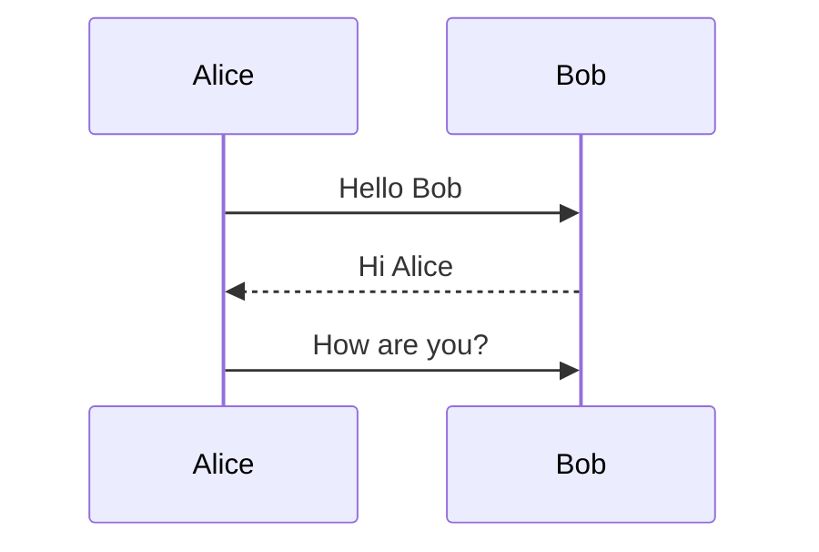

# Advanced Markdown Features in Obsidian

Advanced features for mathematical notation, diagrams, footnotes, and more.

## Math (LaTeX)

Render mathematical expressions using LaTeX syntax.

### Inline Math

```markdown
$x^2$ Superscript
$x_i$ Subscript
$\frac{a}{b}$ Fraction
$\sqrt{x}$ Square root
$\sum_{i=1}^{n}$ Summation
$\int_a^b$ Integral
$\alpha, \beta$ Greek letters
```

### Display Math (Block)

```markdown
$$
E = mc^2
$$
```

### Common Math Syntax

| Notation      | Syntax                | Renders As |
| ------------- | --------------------- | ---------- |
| Superscript   | `x^2`                 | x²         |
| Subscript     | `x_i`                 | xᵢ         |
| Fraction      | `\frac{a}{b}`         | a/b        |
| Square root   | `\sqrt{x}`            | √x         |
| Greek letters | `\alpha \beta \gamma` | α β γ      |
| Summation     | `\sum_{i=1}^{n}`      | Σ notation |
| Integral      | `\int_a^b`            | ∫ notation |

## Diagrams (Mermaid)

Create flowcharts, sequence diagrams, and other visualizations.

### Flowchart

````markdown

````

### Sequence Diagram

````markdown

````

### Other Diagram Types

Mermaid supports: Class diagrams, State diagrams, Entity-relationship diagrams, Gantt charts, and more.

## Footnotes

Add references and citations with footnotes.

```markdown
This sentence has a footnote[^1].

[^1]: This is the footnote content.

You can also use named footnotes[^note].

[^note]: Named footnotes still appear as numbers.

Inline footnotes are also supported.^[This is an inline footnote.]
```

Footnotes appear at the bottom of the note in reading view.

## Comments

Hide text from reading view:

```markdown
This is visible %%but this is hidden%% text.

%%
This entire block is hidden.
It won't appear in reading view.
%%
```

Useful for:

- Internal notes
- Revision tracking
- Temporary reminders

## Horizontal Rules

Create visual separators:

```markdown
---
---

---
```

Any line with three or more hyphens, asterisks, or underscores creates a rule.

## HTML in Markdown

Embed raw HTML for custom formatting:

```markdown
<div class="custom-container">
  <span style="color: red;">Colored text</span>
</div>

<details>
  <summary>Click to expand</summary>
  Hidden content here.
</details>

<kbd>Ctrl</kbd> + <kbd>C</kbd>
```

### Common HTML Elements

- `<details>/<summary>` - Expandable sections
- `<kbd>` - Keyboard key styling
- `<mark>` - Highlighting
- `<div>/<span>` - Custom containers
- `<style>` - Inline styling

## Code Blocks

Format code with syntax highlighting:

````markdown
```python
def hello_world():
    print("Hello, World!")
```

```javascript
const greeting = "Hello";
console.log(greeting);
```

```yaml
key: value
nested:
  property: data
```
````

Supported languages: Python, JavaScript, Java, C++, HTML, CSS, YAML, JSON, Bash, and hundreds more.

## Line Breaks and Spacing

Control whitespace in your notes:

```markdown
This is a paragraph.

This is another paragraph (blank line creates separation).

For a line break within a paragraph, add two spaces at the end  
or use Shift+Enter.
```

## Table Alignment

Control column alignment in tables:

```markdown
| Left | Center | Right |
| :--- | :----: | ----: |
| L    |   C    |     R |
```

- `:---` = Left align
- `:---:` = Center align
- `---:` = Right align

## Special Characters and Escaping

Escape special Markdown characters with backslash:

```markdown
\*This won't be italic\*
\#This won't be a heading
1\. This won't be a list item
```

Common characters to escape: `\*`, `\_`, `\#`, `` \` ``, `\|`, `\~`
