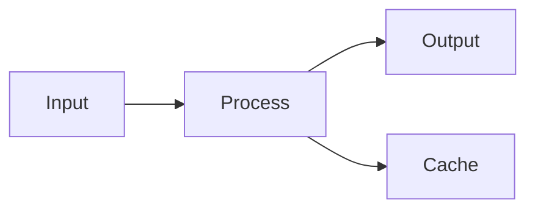

# Obsidian Markdown Example

A complete example note demonstrating all major Obsidian Markdown features.

````markdown
---
title: Project Alpha
date: 2024-01-15
tags:
  - project
  - active
status: in-progress
priority: high
---

# Project Alpha

## Overview

This project aims to [[improve workflow]] using modern techniques. See also [[Related Project]] for context.

> [!important] Key Deadline
> The first milestone is due on ==January 30th==.

## Tasks

- [x] Initial planning
- [x] Resource allocation
- [ ] Development phase
  - [ ] Backend implementation
  - [ ] Frontend design
- [ ] Testing
- [ ] Deployment

## Technical Notes

The main algorithm uses the formula $O(n \log n)$ for sorting.

```python
def process_data(items):
    return sorted(items, key=lambda x: x.priority)
```
````

For more details on the algorithm, see [Algorithm Design](https://example.com/algo).

## Architecture



## Related Documents

- ![[Meeting Notes 2024-01-10#Decisions]]
- [[Budget Allocation|Budget Document]]
- [[Team Members]]

## References

For more details, see the official documentation[^1].

[^1]: <https://example.com/docs>

## Implementation Checklist

| Task      | Status | Owner |   Due Date |
| --------- | :----: | ----- | ---------: |
| Design    |   ✓    | Alice | 2024-01-10 |
| Dev Setup |   ✓    | Bob   | 2024-01-12 |
| Backend   |   ⏳   | Alice | 2024-02-01 |
| Frontend  |   ⏳   | Bob   | 2024-02-15 |

> [!tip] Use the architecture diagram
> Refer to the mermaid diagram above for system overview.

> [!warning] Breaking Changes
> Version 2.0 has breaking API changes.
>
> > [!note] Migration Guide
> > See [[Migration Guide]] for details.

%%
Internal notes:

- Review with team on Friday
- Consider alternative approaches
- Check compatibility with v1.9
  %%

```

This example demonstrates:
- **Frontmatter** - Title, date, tags, status
- **Headings** - Multiple levels for structure
- **Wikilinks** - Links to other notes
- **Embeds** - Including content from other notes
- **Callouts** - Note, important, tip, warning with nesting
- **Markdown formatting** - Bold, italic, strikethrough, highlight
- **Checkboxes** - Task tracking
- **Code blocks** - Python syntax highlighting
- **External links** - Standard Markdown links
- **Math** - LaTeX equations
- **Diagrams** - Mermaid flowchart
- **Tables** - Aligned columns
- **Footnotes** - Reference citations
- **Comments** - Hidden internal notes
```
